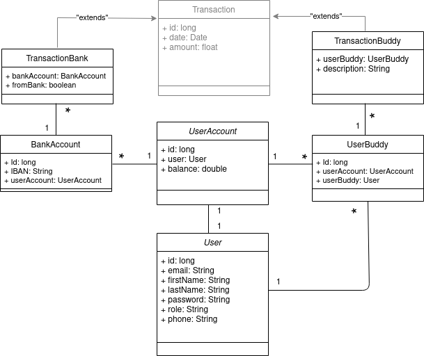

# PayMyBuddy_transfer
Prototype: web application Java with Spring Boot

---
**Table of content**

---
1.Diagramme de classe

2.Modèle physique de données

3.Scripts SQL

4.Couche DAL/référentiel

5.Méthode sécurisée

6.Interface web 

----

**Diagramme de classe**

---

___

**Modèle physique de données**

---

---
